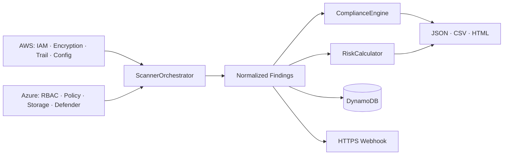
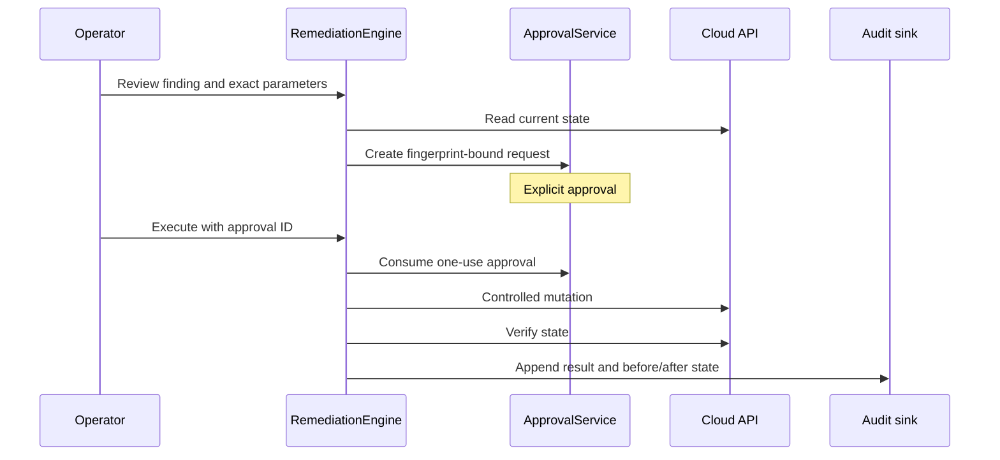

# Architecture

Cloud-specific scanners are read-only adapters. Everything after normalization is provider-neutral.
Expected failure in one cloud does not discard successful results from the other.

`ComplianceWorkflowService` owns the sequence. FastAPI, Lambda and Azure Functions validate
transport input, enforce access control and delegate. Reports and alerts use allowlisted fields.

## Remediation boundary

Dry runs stop after review. Invalid, mismatched and replayed approvals never mutate cloud state and
are still audited. AWS and Azure use separate scan/remediation identities. DynamoDB details are in
[dynamodb-schema.md](dynamodb-schema.md); deployment boundaries are in the infrastructure guide.
